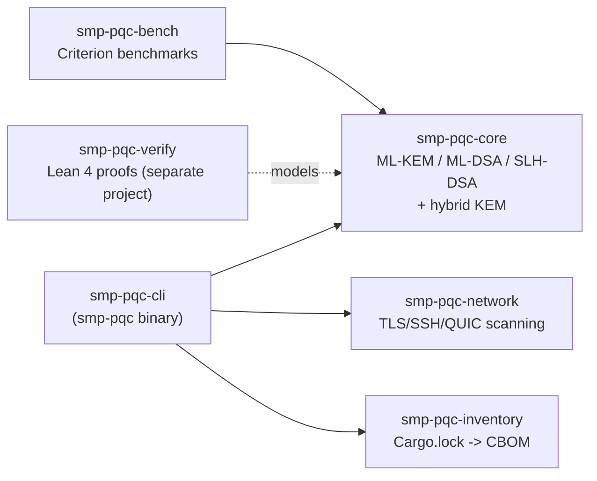

# smp-pqc-testkit

```
   _____ __  __ _____    _____   ____   _____
  / ____|  \/  |  __ \  |  __ \ / __ \ / ____|
 | (___ | \  / | |__) | | |__) | |  | | |
  \___ \| |\/| |  ___/  |  ___/| |  | | |
  ____) | |  | | |      | |    | |__| | |____
 |_____/|_|  |_|_|      |_|     \____/ \_____
 
```

[](https://github.com/rwilliamspbg-ops/smp-pqc-testkit/actions/workflows/ci.yml)
[](https://codecov.io/gh/rwilliamspbg-ops/smp-pqc-testkit)
[](https://crates.io/crates/smp-pqc-core)
[](https://docs.rs/smp-pqc-core)
[](Cargo.toml)
[](LICENSE)

Sovereign Mohawk Post-Quantum Cryptography Test Kit

A **pure-Rust, memory-safe** test kit for NIST post-quantum cryptography
(FIPS 203 ML-KEM, FIPS 204 ML-DSA, FIPS 205 SLH-DSA) and classical/PQC
hybrids — validated against real **NIST ACVP known-answer vectors**, not
just internal self-consistency, with **Lean 4-proved** control-flow logic
for the hybrid combiner. It doesn't implement these algorithms from
scratch (it wraps the RustCrypto `ml-kem`/`ml-dsa`/`slh-dsa` crates); what
it adds is correctness validation, real TLS/SSH/QUIC handshake scanning
(reporting what actually got negotiated, not just what's advertised),
and cryptography inventory/CBOM generation — see
[docs/comparison.md](docs/comparison.md) for exactly how this differs
from liboqs/PQClean and when to reach for one of those instead. Also used
as a component for the Mohawk-Nexus / SMIP-MWP-Rust / smp-tee-runtime /
Sovereign-Mohawk-Proto stack.

## Documentation

- [Getting Started](#getting-started)
- [Status](#status)
- [Usage](#usage)
- [Architecture](#architecture)
- [Roadmap](#roadmap)
- [Publishing](#publishing)
- [Contributing](#contributing)
- [License](#license)
- [How this compares to liboqs/PQClean](docs/comparison.md)
- [Benchmark results](docs/benchmarks.md)
- [Why this exists](docs/why-this-exists.md)

### Getting Started

See [CONTRIBUTING.md](CONTRIBUTING.md) for detailed setup instructions,
coding standards, and contribution guidelines.

See [CODE_OF_CONDUCT.md](CODE_OF_CONDUCT.md) for our community standards.

See [SECURITY.md](SECURITY.md) for our security vulnerability reporting process.

## Status

1.0.0, stable API. What actually works today:

- `smp-pqc-core`: safe wrappers over [`ml-kem`](https://crates.io/crates/ml-kem),
  [`ml-dsa`](https://crates.io/crates/ml-dsa), and [`slh-dsa`](https://crates.io/crates/slh-dsa)
  (all pure-Rust RustCrypto implementations), plus an illustrative
  X25519 + ML-KEM-768 hybrid KEM.
- `smp-pqc-cli` (`smp-pqc` binary): `test kem` and `test sig` subcommands run
  real correctness roundtrips (keygen/encapsulate-or-sign/decapsulate-or-verify,
  including tamper-detection checks for signatures).
- `smp-pqc-bench`: real Criterion benchmarks for keygen/encapsulate/decapsulate
  and keygen/sign/verify across every ML-KEM/ML-DSA/SLH-DSA parameter set,
  plus an X25519 classical baseline for comparison.
- Test suite: `smp-pqc-core`'s algorithm logic (kem.rs/sig.rs) is at 95%+
  line/function coverage; `smp-pqc-cli`'s argument-dispatch/config-merge
  code (main.rs/config.rs) is at 95%+ lines / 85%+ functions, including a
  `--config <toml>` end-to-end test and full `verify-all` coverage. The
  remaining gap is specifically SSH/QUIC's "handshake succeeded but didn't
  negotiate PQC" branches, which need a local test server neither protocol
  has yet (unlike `scan tls`) — see `docs/threat-model.md`. Both floors are
  enforced separately in CI via `cargo-llvm-cov` (90%/90% lines,
  90%/80% functions for core/cli respectively, giving a small margin below
  the measured numbers), rather than one combined figure that would either
  be unenforceable or mask a real regression in the higher-coverage crate.
  Includes proptest-based property tests (arbitrary-message signing,
  single-byte ciphertext/message tamper rejection across randomized
  offsets), adversarial tests (wrong keys, corrupted signature/ciphertext
  bytes, ML-KEM implicit rejection),
  and CLI-level integration tests via `assert_cmd`.
- `smp-pqc-core/fuzz`: a `cargo-fuzz` target for the algorithm-name parsers.
  Narrow in scope (there's no byte-serialization API to fuzz yet — see
  [docs/threat-model.md](docs/threat-model.md)) and Linux-only in practice;
  runs in CI, not on this project's Windows dev machine.
- `smp-pqc-core/test-vectors` + `smp-pqc-core/tests/acvp.rs`: KAT smoke tests against
  NIST's own ACVP-Server reference vectors (ML-KEM keygen + encapsulation +
  decapsulation, including NIST's own implicit-rejection cases; ML-DSA/SLH-DSA
  keygen; ML-DSA/SLH-DSA signature verification including deliberately-
  corrupted negative cases, with context strings). This validates the
  underlying RustCrypto crates against NIST's ground truth, not just internal
  self-consistency — see [smp-pqc-core/test-vectors/SOURCE.md](smp-pqc-core/test-vectors/SOURCE.md)
  for exactly what's covered and what isn't (no prehash mode).
- `smp-pqc-network` (`scan tls`, `scan ssh`): real handshake scanners
  reporting the actually negotiated key-exchange algorithm.
  - `scan tls` uses rustls 0.23's native ML-KEM/hybrid support
    (`X25519MLKEM768`, `secp256r1MLKEM768`, pure `MLKEM512/768/1024` via the
    `aws-lc-rs` crypto provider — no separate PQC crate needed). Validates
    certificates against the Mozilla root store by default; `--insecure`
    skips validation for scanning local test infrastructure with a
    self-signed certificate. Tested against a local rustls server (no
    external network dependency in CI) and manually verified against real
    production infrastructure.
  - `scan ssh` uses `russh` 0.62's native `mlkem768x25519-sha256` hybrid KEX
    support (matching OpenSSH 9.x+). Does not verify host identity (accepts
    any host key — there's no CA equivalent for SSH the way there is for
    TLS); manually verified against `github.com`'s real SSH endpoint
    (currently negotiates `curve25519-sha256`, correctly reported as
    non-PQC). No local test-server coverage for the positive-detection path
    yet, unlike `scan tls` — see [docs/threat-model.md](docs/threat-model.md).
  - **Only scan hosts you own or are explicitly authorized to test.**
- `smp-pqc-inventory` (`inventory` / `inventory --cbom`): scans a
  `Cargo.lock` and classifies known crypto crates (PQC vs. classical, and by
  primitive — KEM, signature, cipher, hash, MAC, protocol, RNG, or
  supporting utility), emitting either a human-readable summary or a
  CycloneDX-shaped cryptography bill of materials (CBOM). Name-based
  classification against a curated table, not static analysis of actual
  code usage — see the honesty note in `smp-pqc-inventory/src/classify.rs`
  for exactly what that does and doesn't mean.
- `smp-pqc-verify`: a Lean 4 project with real, machine-checked, `sorry`-free
  proofs about `smp-pqc-core`'s control-flow logic (the hybrid KEM combiner,
  and the signature-report aggregation accounting) — not proofs about the
  cryptographic primitives themselves. Runs in CI (`lean-verify` job). See
  `smp-pqc-verify/README.md` for exactly what's proved and what isn't.
- `smp-pqc-core/examples/dudect_ml_kem_decap.rs`: a real DudeCT-based
  constant-time check for ML-KEM-768 decapsulation (valid vs. corrupted
  ciphertext timing). Measured result: no timing leak detected across
  300,000+ samples on this project's dev machine — see
  [docs/threat-model.md](docs/threat-model.md)'s side-channel section for
  the exact numbers and, importantly, what that result does and doesn't
  prove. One operation, one corruption pattern, not run in CI (shared
  runners are too noisy for trustworthy timing measurements) — broad
  constant-time coverage across every operation is still future work.

Still not implemented: QUIC scanning, and TEE attestation and AF_XDP
zero-copy benchmarking (blocked on hardware — even WSL2 doesn't unblock
these, see the threat model doc). The relevant CLI subcommands
exist but exit with an explicit, specific error rather than faking output.

## Usage

```bash
cargo build --workspace

# KEM roundtrip correctness test
cargo run -p smp-pqc-cli -- test kem ml-kem-768 --iterations 10000

# Classical/PQC hybrid KEM
cargo run -p smp-pqc-cli -- test kem ml-kem-768 --hybrid --iterations 1000

# Signature roundtrip + tamper-detection test
cargo run -p smp-pqc-cli -- test sig ml-dsa-65 --iterations 1000
cargo run -p smp-pqc-cli -- test sig slh-dsa-shake-128f --iterations 20 --report json

# Criterion benchmarks (release mode; several minutes for the full suite due
# to slow SLH-DSA "s" variants -- see smp-pqc-bench/benches/sig.rs)
cargo bench -p smp-pqc-bench --bench kem
cargo bench -p smp-pqc-bench --bench sig

# TLS/SSH PQC/hybrid handshake scans (only scan hosts you own or are
# authorized to test)
cargo run -p smp-pqc-cli -- scan tls example.com --pqc-only --report json
cargo run -p smp-pqc-cli -- scan ssh example.com --report json

# Cryptography inventory / CBOM for this workspace's own dependencies
cargo run -p smp-pqc-cli -- inventory .
cargo run -p smp-pqc-cli -- inventory . --cbom --output report.cdx.json

# Constant-time check: ML-KEM-768 decapsulation, valid vs. corrupted
# ciphertext (--release matters -- see the file's doc comment)
cargo run -p smp-pqc-core --release --example dudect_ml_kem_decap

# Run the test suite, including NIST ACVP KAT checks (takes ~100-110s:
# SLH-DSA-256s alone is ~1-2 min/sign in an unoptimized build without the
# workspace's dependency opt-level override -- see Cargo.toml and
# smp-pqc-core/src/sig.rs for why)
cargo test --workspace

# Lean 4 formal verification proofs (requires a Lean toolchain via elan;
# see smp-pqc-verify/README.md)
(cd smp-pqc-verify && lake build)

# Example integrations
cargo run -p smp-pqc-core --example basic_usage
cargo run -p smp-pqc-core --example dudect_ml_kem_decap
cargo run -p smp-pqc-core --example mohawk_nexus_integration
cargo run -p smp-pqc-core --example smip_mwp_integration
```

Supported `test kem` algorithms: `ml-kem-512`, `ml-kem-768`, `ml-kem-1024`.

Supported `test sig` algorithms: `ml-dsa-44`, `ml-dsa-65`, `ml-dsa-87`, and all
12 SLH-DSA FIPS-205 parameter sets (`slh-dsa-{shake,sha2}-{128,192,256}{f,s}`).

## Architecture

```
smp-pqc-testkit/
├── smp-pqc-core/       # Safe abstractions over ML-KEM/ML-DSA/SLH-DSA + hybrids
│   ├── examples/         # basic_usage.rs (library usage), dudect_ml_kem_decap.rs (constant-time check)
│   │   ├── mohawk_nexus_integration.rs (Mohawk-Nexus integration example)
│   │   └── smip_mwp_integration.rs (SMIP-MWP-Rust integration example)
│   ├── fuzz/             # cargo-fuzz target for the algorithm-name parsers (Linux-only)
│   ├── test-vectors/     # Sampled NIST ACVP-Server reference vectors + provenance (SOURCE.md)
│   └── tests/acvp.rs     # NIST ACVP known-answer tests
├── smp-pqc-cli/        # smp-pqc binary
├── smp-pqc-bench/      # Criterion benchmarks (keygen/encap/decap, keygen/sign/verify)
├── smp-pqc-network/    # TLS PQC/hybrid handshake scanning (rustls + aws-lc-rs)
├── smp-pqc-inventory/  # Cryptography inventory / CycloneDX CBOM generation
├── smp-pqc-verify/     # Lean 4 project: machine-checked control-flow proofs
├── docs/                 # Threat model, architecture notes
├── .github/              # CI/publish workflows, issue/PR templates, Dependabot
├── justfile              # Common dev commands (`just --list`)
├── deny.toml             # cargo-deny: advisories/licenses/bans/sources gate
├── CONTRIBUTING.md       # Contribution guidelines
├── CODE_OF_CONDUCT.md    # Community standards
└── SECURITY.md           # Security policy
```

`smp-pqc-core/examples/mohawk_nexus_integration.rs` demonstrates how to integrate the testkit with
the Mohawk-Nexus networking stack.

`smp-pqc-core/examples/smip_mwp_integration.rs` demonstrates how to integrate the testkit with
the SMIP-MWP-Rust secure multiparty computation workflow.

Crate dependency graph (arrows point from dependent to dependency;
`smp-pqc-verify` is a separate Lean 4 project that models `smp-pqc-core`'s
control-flow logic by hand, not a Cargo dependency of it):



## Roadmap

See [docs/ROADMAP.md](docs/ROADMAP.md) for the post-1.0.0 roadmap —
what's planned, what's deliberately cut (and why), and the strategic
choice behind it (narrow/deep/pure-Rust over broad/shallow/liboqs-style
breadth). See [docs/threat-model.md](docs/threat-model.md) for the threat
model this kit is designed against, and the platform-level blockers
(AF_XDP, TEE attestation — hardware, not just an OS/kernel; WSL2 doesn't
unblock either) that predate the roadmap and still apply.

## Publishing

`smp-pqc-core`, `smp-pqc-cli`, `smp-pqc-network`, and `smp-pqc-inventory`
are prepared for crates.io: full metadata, self-contained packages (every
`include_str!`/test fixture lives inside its own crate directory — verified
with `cargo package`, not just asserted), and a `.github/workflows/publish.yml`
that publishes automatically on a `vX.Y.Z` tag push once a
`CARGO_REGISTRY_TOKEN` repository secret is added. See
[RELEASING.md](RELEASING.md) for the full release process.

`smp-pqc-bench` (bench-only, no library) and `smp-pqc-verify` (a Lean 4
project, not a Cargo crate) are not published.

## Contributing

We welcome contributions! Please see [CONTRIBUTING.md](CONTRIBUTING.md) for
details on how to contribute to this project, including development setup,
coding standards, and the pull request process.

Please also review our [CODE_OF_CONDUCT.md](CODE_OF_CONDUCT.md) and
[SECURITY.md](SECURITY.md) documents.

## License

Apache-2.0 — see [LICENSE](LICENSE).